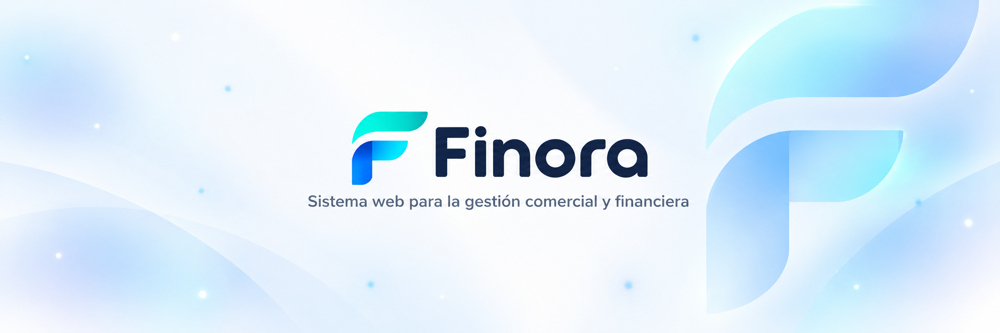

<p align="center">
  
</p>

<p align="center">
  <strong>Gestión comercial y financiera para emprendimientos de venta por catálogo</strong>
</p>

<p align="center">
  Sistema web orientado a centralizar productos, inventario, compras, ventas, créditos y reportes en una sola plataforma.
</p>

<p align="center">
  
  
  
  
  
</p>

---

## Sobre el proyecto

**Finora** es un sistema de información web desarrollado para apoyar la gestión comercial y financiera de emprendimientos de venta por catálogo.

El caso de estudio corresponde a una asesora independiente que actualmente trabaja con **Natura**. Sin embargo, la solución se plantea con una estructura adaptable a otros emprendimientos de características similares y a distintas marcas de venta por catálogo.

El proyecto busca reemplazar la gestión dispersa entre **WhatsApp, agendas, cuadernos y hojas de cálculo** por una plataforma centralizada, organizada y accesible desde la web.

> **Título académico:** *Sistema de Información Web para la Gestión Comercial y Financiera de un Emprendimiento de Venta por Catálogo.*

> **Nota:** Finora es un proyecto académico e independiente. No mantiene afiliación oficial con Natura ni con otras marcas mencionadas como posibles casos de uso.

## Funcionalidades previstas

| Área | Alcance |
| --- | --- |
| **Usuarios y roles** | Administración de usuarios y control de acceso según el rol asignado. |
| **Productos y catálogo** | Registro, organización y consulta de productos disponibles. |
| **Líneas de productos** | Clasificación de productos por líneas o categorías. |
| **Proveedores** | Gestión de proveedores relacionados con las compras. |
| **Compras** | Registro y consulta de compras realizadas. |
| **Lotes** | Control de lotes asociados al ingreso de productos. |
| **Inventario** | Control de existencias y disponibilidad de stock. |
| **Ventas** | Registro de ventas al contado y a crédito. |
| **Créditos y cuotas** | Seguimiento de saldos pendientes, cuotas y pagos. |
| **Consultas** | Consulta histórica de compras, ventas y créditos. |
| **Reportes** | Información comercial y financiera para apoyar la toma de decisiones. |
| **Catálogo para clientes** | Consulta de productos disponibles por parte del cliente. |

## Actores del sistema

| Actor | Responsabilidad principal |
| --- | --- |
| **Administrador** | Gestiona usuarios, roles, configuraciones y funciones administrativas. |
| **Asesor** | Gestiona productos, compras, inventario, ventas, créditos y consultas. |
| **Cliente** | Consulta el catálogo y accede a las funcionalidades habilitadas para su rol. |

## Tecnologías

| Tecnología | Uso |
| --- | --- |
| **Laravel 13** | Framework principal de la aplicación web. |
| **PHP 8.3+** | Lenguaje de programación del backend. |
| **MySQL 8.0+** | Sistema gestor de base de datos relacional. |
| **Blade** | Renderizado de vistas del lado del servidor. |
| **Vite** | Gestión y compilación de recursos frontend. |
| **Composer** | Gestión de dependencias PHP. |
| **Node.js / npm** | Gestión de dependencias y recursos frontend. |
| **Git + GitHub** | Control de versiones y colaboración. |
| **Jira** | Gestión del Product Backlog, historias de usuario, tareas y sprints. |
| **Scrum** | Metodología utilizada para organizar el desarrollo. |

## Arquitectura base

El proyecto sigue la estructura y las convenciones de Laravel, utilizando una separación de responsabilidades basada en su enfoque MVC y en los componentes propios del framework.

```text
sistema-informacion-web/
├── app/            # Lógica principal de la aplicación
├── bootstrap/      # Inicialización de Laravel
├── config/         # Configuración del sistema
├── database/       # Migraciones, seeders y factories
├── public/         # Punto de entrada y recursos públicos
├── resources/      # Vistas, estilos y JavaScript
├── routes/         # Definición de rutas
├── storage/        # Archivos generados por la aplicación
└── tests/          # Pruebas automatizadas
```

## Requisitos

Antes de ejecutar el proyecto localmente se necesita:

- **PHP 8.3 o superior**
- **Composer**
- **MySQL Server 8.0 o superior**
- **Node.js y npm**
- **Git**

## Instalación local

### 1. Clonar el repositorio

```bash
git clone https://github.com/TU-USUARIO/sistema-informacion-web.git
cd sistema-informacion-web
```

### 2. Instalar dependencias

```bash
composer install
npm install
```

### 3. Crear el archivo de entorno

En Linux, macOS o Git Bash:

```bash
cp .env.example .env
```

En Windows CMD:

```cmd
copy .env.example .env
```

Generar la clave de la aplicación:

```bash
php artisan key:generate
```

### 4. Configurar MySQL

Crear una base de datos local:

```sql
CREATE DATABASE sistema_informacion_web
CHARACTER SET utf8mb4
COLLATE utf8mb4_unicode_ci;
```

Configurar la conexión en `.env`:

```env
DB_CONNECTION=mysql
DB_HOST=127.0.0.1
DB_PORT=3306
DB_DATABASE=sistema_informacion_web
DB_USERNAME=root
DB_PASSWORD=
```

Limpiar la configuración cargada por Laravel:

```bash
php artisan config:clear
```

> Las credenciales reales se mantienen únicamente en `.env`. Este archivo no debe versionarse ni publicarse en el repositorio.

### 5. Ejecutar migraciones

El esquema de la base de datos se construirá progresivamente durante el desarrollo. Cuando las migraciones correspondientes estén disponibles:

```bash
php artisan migrate
```

### 6. Ejecutar el proyecto

```bash
composer run dev
```

La aplicación estará disponible normalmente en:

```text
http://localhost:8000
```

## Pruebas

Las pruebas automatizadas pueden ejecutarse con:

```bash
php artisan test
```

## Flujo de trabajo

La rama estable del proyecto es:

```text
main
```

Las funcionalidades, correcciones y tareas de mantenimiento se desarrollan en ramas independientes.

Ejemplos:

```text
feature/hu01-inicio-sesion
feature/hu02-gestion-usuarios
fix/inventario-calculo-stock
chore/repository-setup
```

Antes de comenzar una nueva rama de trabajo:

```bash
git checkout main
git pull
git checkout -b feature/huXX-descripcion
```

### Commits, issues y pull requests

El proyecto utiliza **Conventional Commits** con `scope` obligatorio:

```text
type(scope): descripción
```

Ejemplos:

```text
feat(auth): implementar inicio de sesión
fix(inventory): corregir cálculo de stock
chore(project): actualizar configuración del proyecto
docs(readme): actualizar documentación principal
refactor(sales): simplificar registro de ventas
test(credits): agregar pruebas de cuotas pendientes
```

| Tipo | Uso |
| --- | --- |
| `feat` | Nueva funcionalidad. |
| `fix` | Corrección de errores. |
| `docs` | Cambios de documentación. |
| `chore` | Configuración y mantenimiento. |
| `refactor` | Reestructuración sin alterar el comportamiento esperado. |
| `test` | Creación o modificación de pruebas. |
| `style` | Cambios de formato o presentación sin alterar la lógica. |
| `perf` | Mejoras de rendimiento. |
| `build` | Cambios relacionados con dependencias o compilación. |
| `ci` | Cambios relacionados con integración continua. |

Los títulos de **issues** y **pull requests** siguen la misma convención.

## Gestión del proyecto

El desarrollo se organiza mediante **Scrum** y se administra en Jira utilizando:

- Product Backlog
- Épicas
- Historias de usuario
- Puntos de historia
- Prioridades
- Sprints
- Tareas y subtareas
- Tablero de seguimiento
- Límites de trabajo en progreso (**WIP**)

## Estado del proyecto

> **En desarrollo**

Actualmente el proyecto cuenta con la base técnica inicial en Laravel, control de versiones con Git y GitHub, y conexión con MySQL.

Las funcionalidades se incorporarán progresivamente de acuerdo con las historias de usuario y los sprints definidos.

## Seguridad y buenas prácticas

- No versionar archivos `.env` ni credenciales.
- Mantener claves y contraseñas fuera del código fuente.
- Utilizar migraciones para versionar la estructura de la base de datos.
- Aplicar validaciones en la aplicación y, cuando corresponda, restricciones en la base de datos.
- Mantener `main` como rama estable.
- Desarrollar cambios mediante ramas y pull requests.
- Mantener commits pequeños, claros y consistentes.
- Revisar los cambios antes de integrarlos a `main`.

## Licencia

La licencia del proyecto se encuentra **pendiente de definición por el equipo**.

---

<p align="center">
  <strong>Finora</strong><br>
  Proyecto académico de Sistema de Información Web<br>
  Desarrollado con Laravel, PHP y MySQL.
</p>
